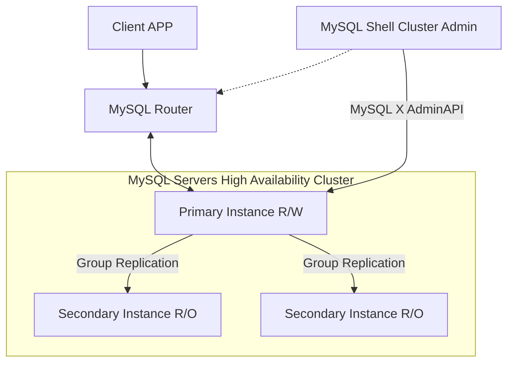

# 数据库双主及主从配置方案

## 方案选择

### 1. MySQL InnoDB Cluster

每台服务器实例都运行MySQL Group Replication（冗余复制机制，内置failover）

> MGR有两种模式，一种是`Single-Primary`，一种是`Multi-Primary`，即单主和多主
> 注意：`Multi-Primary`模式中，所有的节点都是主节点，都可以同时被读写，看上去这似乎更好，但是因为多主的复杂性，在功能上如果设置了多主模式，则会有一些使用的限制，比如不支持`Foreign Keys with Cascading Constraints`

### 2. 工作原理

MySQL InnoDB集群提供了一个集成的，本地的，HA解决方案。Mysql Innodb Cluster 是利用组复制的Paxos协议，保障数据一致性，组复制支持单主模式和多主模式。

#### 2.1. MySQL InnoDB集群的组成部分

- `MySQL Servers with Group Replication`: 向集群的所有成员复制数据，同时提供容错、自动故障转移和弹性。（5.7.17或更高的版本）
- `MySQL Router`: 确保客户端请求是负载均衡的，并做任何数据故障时路由到正确的服务器。（2.1.3或更高的版本）
- `MySQL Shell`: 通过内置的管理API创建及管理InnoDB集群。（1.0.9或更高的版本）

各个组件的关系和工作流程如下



## 集群方案

两台主机，分别为172.18.255.18和172.18.255.19
其中172.18.255.18作为管理节点，安装`mysql-server`,`mysql-shell`,`mysql-router`，主机名称为`master`
172.18.255.19作为备选节点，安装`mysql-server`,`mysql-shell`，名称为`slave1`

## 环境准备

### 1. 关闭selinux

```shell
vim /etc/selinux/config

修改后：SELINUX=disabled
```

### 2. 编辑limits

```shell
vim /etc/security/limits.conf

末尾增加：
* soft nofile 65536
* hard nofile 65536
```

### 3. 修改信号量等

```shell
vim /etc/sysctl.conf

增加：
vm.max_map_count=655360
kernel.sem=1024 32000 100 2048

保存后使生效：
sysctl -p
```

### 4. 修改hosts

```shell
vim /etc/hosts

增加：
172.18.255.18 master
172.18.255.19 slave1
```

### 5. 增加security参数

```shell
vim /etc/pam.d/login

增加：
session required pam_limits.so
```

## 软件安装（`root`用户)

### 1. 安装MySQL源

```
cd ~
wget https://dev.mysql.com/get/mysql80-community-release-el7-3.noarch.rpm
rpm -ivh mysql80-community-release-el7-7.noarch.rpm
```

### 2. 按需安装不同组件

```shell
yum install -y mysql-server
yum install -y mysql-shell
yum install -y mysql-router
```

## 配置数据库

### 1. 编辑配置文件`/etc/my.conf`

> 1. 配置文件中`server_id`及`loose-group_replication_local_address`每台主机中配置不同，需修改
> 2. 初次配置是需将`group_replication相关配置`注释掉

```shell
# For advice on how to change settings please see
# http://dev.mysql.com/doc/refman/8.0/en/server-configuration-defaults.html

[mysqld]
#
# Remove leading # and set to the amount of RAM for the most important data
# cache in MySQL. Start at 70% of total RAM for dedicated server, else 10%.
# innodb_buffer_pool_size = 128M
#
# Remove the leading "# " to disable binary logging
# Binary logging captures changes between backups and is enabled by
# default. It's default setting is log_bin=binlog
# disable_log_bin
#
# Remove leading # to set options mainly useful for reporting servers.
# The server defaults are faster for transactions and fast SELECTs.
# Adjust sizes as needed, experiment to find the optimal values.
# join_buffer_size = 128M
# sort_buffer_size = 2M
# read_rnd_buffer_size = 2M
#
# Remove leading # to revert to previous value for default_authentication_plugin,
# this will increase compatibility with older clients. For background, see:
# https://dev.mysql.com/doc/refman/8.0/en/server-system-variables.html#sysvar_default_authentication_plugin
# default-authentication-plugin=mysql_native_password

innodb_buffer_pool_size = 128G
innodb_force_recovery = 0
innodb_temp_data_file_path = ibtmp1:12M:autoextend:max:5G
user        = mysql
port        = 3306
 
 
# slow query
 
slow_query_log = TRUE
slow_query_log_file = /disk/log/mysql/mysql-slow.log
long_query_time = 1
wait_timeout=3600
net_write_timeout=600
interactive_timeout=3600

# buffer

key_buffer_size     = 8G
thread_stack        = 192K
thread_cache_size = 8
max_binlog_size   = 1G
max_allowed_packet=128M


skip-external-locking

datadir=/disk_ssd/data/mysql
socket=/var/lib/mysql/mysql.sock

log-error=/disk/log/mysql/mysqld.log
pid-file=/var/run/mysqld/mysqld.pid

default-storage-engine=INNODB

server_id=1
gtid_mode=ON
enforce_gtid_consistency=ON
master_info_repository=TABLE
relay_log_info_repository=TABLE
binlog_checksum=NONE
log_slave_updates=ON
log_bin=binlog
binlog_format=ROW
max_connections=5000

# group_replication相关配置
transaction_write_set_extraction=XXHASH64
loose-group_replication_group_name="97a68c0e-d8b2-42ca-979e-91598324ecaa"
loose-group_replication_start_on_boot=off
loose-group_replication_local_address="slave1:33061"
loose-group_replication_group_seeds="master:33061,slave1:33061"
loose-group_replication_ip_whitelist="master,slave1,manager"
loose-group_replication_bootstrap_group=off

loose-group_replication_single_primary_mode=on
loose-group_replication_enforce_update_everywhere_checks=off
loose-group_replication_allow_local_disjoint_gtids_join=ON
```

### 2. 创建相关文件夹

```shell
mkdir /disk/log/mysql
mkdir /disk_ssd/data
# 修改文件夹属主
chown -R mysql.mysql /disk/log/mysql
```

### 3. 初始化数据库并启动

```shell
mysqld --initialize-insecure --user=mysql --console
systemctl start mysqld
```

### 4. 修改root密码

```shell
mysql -uroot -p
直接回车，无密码
mysql> ALTER USER 'root'@'localhost' IDENTIFIED BY 'secret';
mysql> flush prifileges;
```

### 5. 安装`group_replication`插件

```shell
mysql> INSTALL PLUGIN group_replication SONAME 'group_replication.so';
mysql> SHOW PLUGINS;
```

### 6. 修改相关配置

> 去掉1中对`/etc/my.cnf`中`group_replication`相关注释，并重启`mysqld`

```shell
vim /etc/my.conf
systemctl restart mysqld
```

## 创建集群

### 1. 使用`master`的`mysql-shell`，登录并创建管理`Cluster`用户（`master`）

```shell
mysqlsh
mysql-js> shell.connect('root@localhost:3306')
mysql-js> dba.configureLocalInstance()
# 此时会全责创建管理cluster的用户，选1，使用root管理，并且允许远程登录'%'
mysql-js> dba.checkInstanceConfiguration('root@localhost:3306')
# 出现如下内容，则配置成功
{
	"status":"ok"
}
```

### 2. 创建集群（`manager`）

连接`master`创建`cluster`

```shell
mysqlsh
mysql-js> shell.connect('root@master:3306')
mysql-js> var cluster=dba.createCluster('onlineCluster')
mysql-js> cluster.status()
```
示例：
```shell
# 创建后，可以看到master已经添加进cluster，并且状态为读写
{
    "clusterName": "onlineCluster",
    "defaultReplicaSet": {
        "name": "default",
        "primary": "master:3306",
        "status": "OK_NO_TOLERANCE",
        "statusText": "Cluster is NOT tolerant to any failures.",
        "topology": {
            "master:3306": {
                "address": "master:3306",
                "mode": "R/W",
                "readReplicas": {},
                "role": "HA",
                "status": "ONLINE"
            }
        }
    }
}
```

### 3. 添加slave1节点（`slave1`）

在slave1节点上操作

```shell
mysqlsh
mysql-js> shell.connect('root@localhost:3306')
mysql-js> dba.configureLocalInstance()
```

在manager上操作添加改节点：

```shell
mysqlsh
mysql-js> shell.connect('root@master:3306')
mysql-js> var cluster=dba.getCluster('onlineCluster')
mysql-js> cluster.addInstance('root@slave1:3306')
```

创建成功后查看状态

```shell
mysql-js> cluster.status()

# 展示内容如下：
{
    "clusterName": "myCluster",
    "defaultReplicaSet": {
        "name": "default",
        "primary": "master:3306",
        "status": "OK_NO_TOLERANCE",
        "statusText": "Cluster is NOT tolerant to any failures.",
        "topology": {
            "master:3306": {
                "address": "master:3306",
                "mode": "R/W",
                "readReplicas": {},
                "role": "HA",
                "status": "ONLINE"
            },
            "slave1:3306": {
                "address": "slave1:3306",
                "mode": "R/O",
                "readReplicas": {},
                "role": "HA",
                "status": "ONLINE"
            }
        }
    }
}
```

## 使用`mysql-router`

在`manager`节点上安装`router`

```
mysqlrouter --bootstrap root@master:3306 -d mysqlrouter --user=root
```

> 这里会在当前路径下生成`mysqlrouter`目录，并生成`router`配置文件，默认通过`route`链接`mysql`后，`6446`端口能进行读写操作，`6447`能进行只读操作

启动`mysqlrouter`

```shell
mysqlrouter/start.sh
```

## 验证`cluster`集群

1. 新建表
2. 关闭`master`的`mysql`服务，`route`会将主节点自动切换到`slave1`，`slave1`从只读变为可读写，重新启动`master`的`mysql`后，`master`将变为只读模式。

## 开启防火墙端口

```shell
firewall-cmd --add-port=3306/tcp --permanent
firewall-cmd --add-port=33061/tcp --permanent
firewall-cmd --add-port=6446/tcp --permanent
firewall-cmd --add-port=6447/tcp --permanent
firewall-cmd --reload
```

## 数据库MySQL 5.7迁移到MySQL 8.0.20方案

### 数据库迁移

1. 开启MySQL 5.7的binlog日志功能

```shell
log_bin=logbin
binlog-format=ROW
server-id=1
```

2. 创建需要同步使用的数据库账号密码

```shell
mysql -uroot -p

mysql> create user 'sync'@'%' identified by 'sync@2020';
mysql> grant replication slave on *.* to 'sync'@'%';
mysql> flush privileges;
```

3. 导出MySQL 5.7库中相关数据表结构，并导出到MySQL 8.0中，可直接使用navicat
4. 查看迁移主机MySQL状态，并记录

```shell
mysql -uroot -p

mysql> show master status;
```

5. 导出MySQL 5.7库中要备份的数据，不包含表结构

```shell
time mysqldump --single-transaction --quick -R --socket=/var/run/mysqld/mysqld.sock -u$username -p -t $databaseName | gzip > asset.`date +%Y%m%d`.sql.gz
```

6. 设置恢复主机MySQL 8.0配置

```shell
server_id=10
gtid_mode=OFF
enforce_gtid_consistency=OFF
slave-skip-errors=all
expire_logs_days=1
binlog_expire_logs_seconds=86400
```
设置完成后重启MySQL

```shell
systemctl restart mysqld
```

7. 将备份文件传输到待恢复主机上

```shell
gunzip < xxx.tar.gz |mysql -u$username -p$password -D$database
```

8. 使用root或有权限用户登录数据库，并执行如下语句，MASTER_LOG_POS和MASTER_LOG_FILE使用4中记录的值

```shell
mysql> CHANGE MASTER TO
  MASTER_HOST='172.18.255.2',
  MASTER_USER='sync',
  MASTER_PASSWORD='sync@2020',
  MASTER_PORT=3306,
  MASTER_LOG_FILE='logbin.003115',
  MASTER_LOG_POS=28809556,
  MASTER_CONNECT_RETRY=10;

mysql> start slave
mysql> show slave status;
```

9. 查看主从当前状态是否一致，当主从状态一致时，同步基本完成，需要停掉所有主库相关写操作，并切断同步进程

```shell
mysql> stop slave;
mysql> reset slave all;
```

### 数据库状态恢复

1. 修改数据库配置文件

```shell
gtid_mode=ON
enforce_gtid_consistency=ON
# slave-skip-errors=all
```

重启数据库

```shell
systemctl restart mysqld
```

2. 恢复MGR

```shell
mysql> set global group_replication_bootstrap_group = ON; 
mysql> start group_replication; 
```

### 恢复业务过程中遇到的问题及解决方法

1. 最终添加的配置包含如下

```shell
character-set-server=utf8
default_authentication_plugin=mysql_native_password
sql_mode = STRICT_TRANS_TABLES
```

### 恢复从库操作

1. 从库配置修改为同主库配置，并重启从库
2. 通过mysqlsh删除之前从库，并重新加入，等待从库同步完成即可